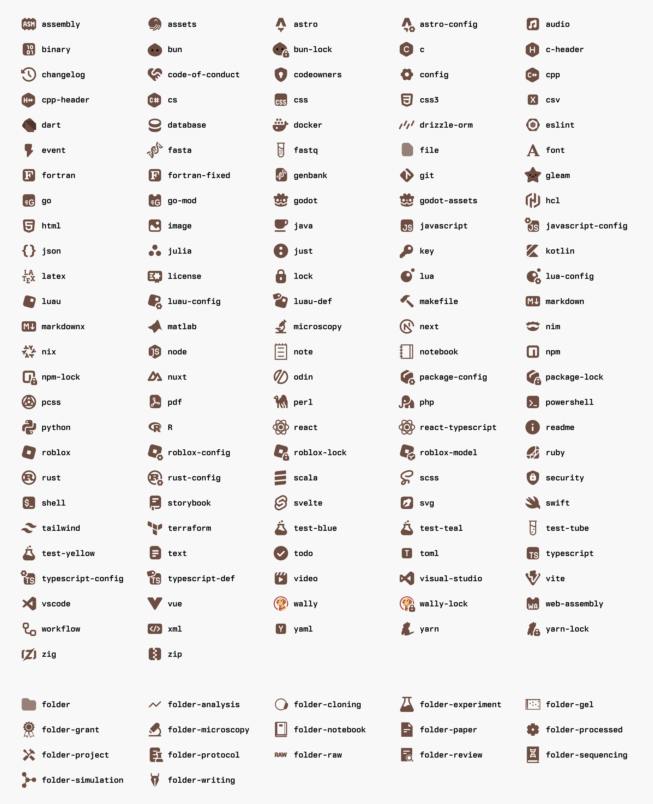

<p align="center">
  <h1 align="center"><b>Lab Icons</b></h1>
</p>

<p align="center">
  
</p>


[](LICENSE.md)


## 📷 Previews

<details>
  <summary>🍫 Chocolate</summary>
  
</details>


## 🔧 Usage

### Manual Install

1. Download the `zip` file from the [Releases](https://github.com/vestalisvirginis/zed-lab-icon-theme/releases) page.
2. Open the extensions tab (`Ctrl+Shift+X`) in Zed.
3. Choose `Install Dev Extension` and select the unzipped release.
4. Open the settings tab (`Ctrl+,`) and add the following:

```json
{
    "icon_theme": "Chocolate Lab Icons"
}
```

### Icon Types

There are 5 sets of icons available, each selectable from the icon theme selector menu (`icon theme selector: toggle`) or by name in your config file:

- `Base Lab Icons`
- `Chocolate Lab Icons`
- `Light Lab Icons`
- `Soft Lab Icons`
- `Warm Lab Icons`


## License

Lab Icons is released under the <a href="LICENSE.md">Creative Commons Attribution 4.0 International License</a>.


## Credits

The repository was fork from [jmesrje](https://github.com/jmesrje/zed-charmed-icons) with the original set of icons designed by [littensy](https://github.com/littensy/charmed-icons).
